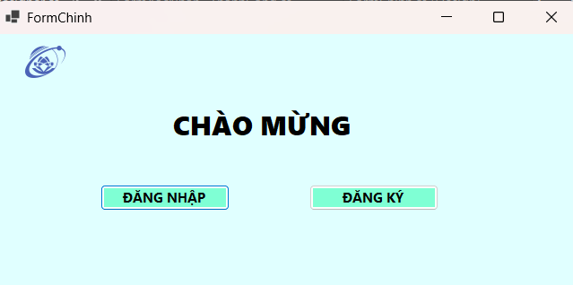
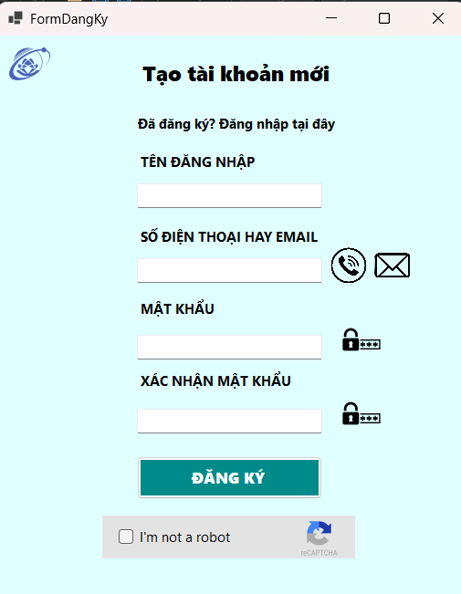
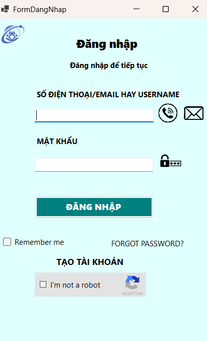
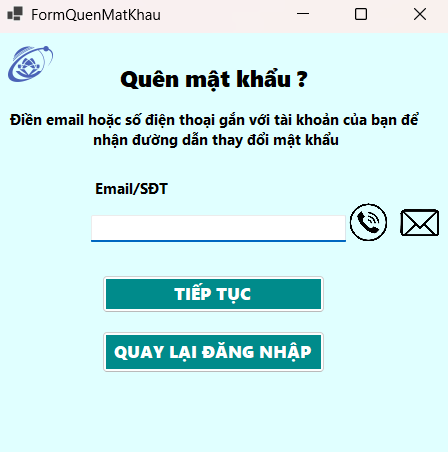
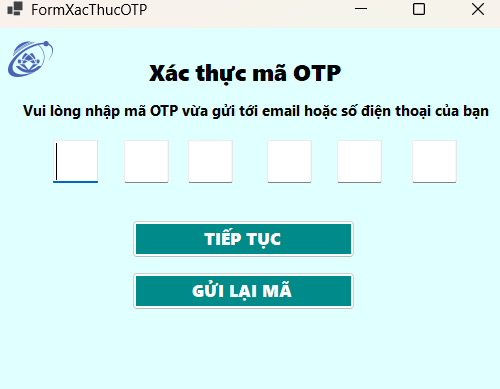
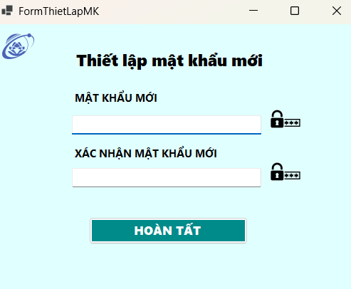
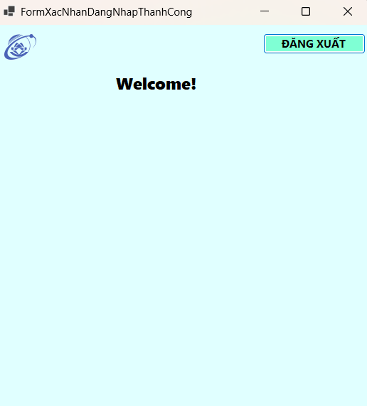

#  Bài tập lập trình mạng – Ứng dụng Đăng ký & Đăng nhập (FormDNDK)

##  Thông tin nhóm

| MSSV | Họ và Tên |
|------|------------|
| 24520943 | **Lâm Tú Lan** |
| 24521005 | **Nguyễn Hoàng Long** |
| 24520903 | **Lục Vĩnh Kiệt** |
| 24520376 | **Huỳnh Thanh Duy** |
| 24520968 | **Phạm Quang Linh** |

##  Mô tả bài tập

Đây là **bài tập tuần 3** trong học phần **Lập trình mạng**, sử dụng **Windows Forms (C#)** kết hợp với **SQL Server** để xây dựng ứng dụng **Đăng ký và Đăng nhập người dùng**.

Ứng dụng cho phép:
- Người dùng đăng ký tài khoản mới.
- Đăng nhập bằng tài khoản đã có.
- Kiểm tra thông tin hợp lệ và lưu dữ liệu trong cơ sở dữ liệu `USERDB`.
- Nếu người dùng đã có tài khoản nhưng quên mật khẩu thì có thể chọn Forgot password? để được nhận mã OTP về email hay SMS để tạo mật khẩu mới.
- Có tính năng Remember me giúp người dùng có thể đăng nhập nhanh chóng những lần tiếp theo.
##  Công nghệ sử dụng

- Ngôn ngữ lập trình: **C# (.NET 8.0 – WinForms)**
- Cơ sở dữ liệu: **Microsoft SQL Server**
- Môi trường phát triển: **Visual Studio 2022**
- Công cụ làm việc nhóm: GitHub desktop
- Hệ điều hành: **Windows**

## Hướng dẫn cài đặt và chạy project

Để ứng dụng hoạt động chính xác, bạn cần thực hiện các bước sau:

---

### 1. Đảm bảo đã cài **SQL Server** và **SQL Server Management Studio (SSMS)**

- Nếu chưa cài, tải và cài theo thứ tự:
  - **SQL Server Developer Edition:** [https://www.microsoft.com/en-us/sql-server/sql-server-downloads](https://www.microsoft.com/en-us/sql-server/sql-server-downloads)
  - **SQL Server Management Studio (SSMS):** [https://aka.ms/ssmsfullsetup](https://aka.ms/ssmsfullsetup)
- Sau khi cài xong, mở **SSMS** và đảm bảo có thể kết nối được đến:
  - Server name: localhost\SQLEXPRESS
  - Authentication: Windows Authentication
- Nếu kết nối thành công → OK

###  2. Clone repository về máy

- Mở **GitHub Desktop**
- Chọn **File → Clone Repository**
- Dán link GitHub của project, ví dụ :https://github.com/HLong145/BT_tuan3_laptrinhmang
- Chọn vị trí lưu trên máy → **Clone**

---
### 3. Tạo cơ sở dữ liệu từ file `USERDB.sql`

- Mở **SQL Server Management Studio (SSMS)**
- Kết nối đến **localhost\SQLEXPRESS**
- Chọn menu **File → Open → File...**
- Mở file `USERDB.sql` trong thư mục project vừa clone
- Nhấn **Execute (F5)** để chạy script tạo cơ sở dữ liệu `USERDB`
- Kiểm tra: trong cây **Databases** thấy xuất hiện `USERDB` là thành công

---
### 4. Kết nối Visual Studio với cơ sở dữ liệu

1. Mở **Visual Studio (VS tím)**
2. Vào menu **View → Server Explorer**
3. Trong cửa sổ **Server Explorer**, nhấn biểu tượng **kết nối cơ sở dữ liệu** (hình tròn màu xanh ở góc trên bên trái)
4. Trong hộp thoại hiện ra:
 - **Server name:** nhập tên instance SQL của bạn (thường là `localhost\SQLEXPRESS`)
 - **Authentication:** Windows Authentication *(hoặc nhập username/password nếu dùng SQL Authentication)*
 - Tick chọn **Trust server certificate**
 - **Select or enter a database name:** chọn `USERDB`
5. Nhấn **OK** để kết nối.

Nếu kết nối thành công ta sẽ thấy `USERDB` xuất hiện trong Server Explorer.

---

### 5. Build và chạy chương trình

1. Mở file solution `FormDNDK.sln` trong Visual Studio
2. Nhấn **Ctrl + Shift + B** để **Build Solution**
3. Sau khi build thành công, nhấn **F5** hoặc nút **Start Debugging** để chạy chương trình.

Ứng dụng sẽ mở ra giao diện đăng nhập/đăng ký, sử dụng cơ sở dữ liệu `USERDB` vừa tạo.
## 🖼️ Các màn hình giao diện ứng dụng

Dưới đây là các form chính trong ứng dụng.  
Bạn có thể chụp ảnh màn hình thật của từng form (bằng **Snipping Tool** hoặc **PrtSc**)  
và lưu ảnh vào thư mục `screenshots/` trong project, sau đó thay link ảnh vào bảng dưới.

| 🧩 Tên Form | 💬 Mô tả chức năng | 🖼️ Ảnh minh họa |
|--------------|--------------------|------------------|
| **FormChinh** | Màn hình chính hiển thị thông tin người dùng sau khi đăng nhập thành công. |  |
| **FormDangKy** | Cho phép người dùng tạo tài khoản mới, nhập tên đăng nhập, mật khẩu, xác nhận mật khẩu và email. |  |
| **FormDangNhap** | Màn hình đăng nhập với tính năng Remember Me, xác thực người dùng và chuyển đến form chính khi thành công. |  |
| **FormQuenMatKhau** | Cho phép người dùng nhập email đã đăng ký để nhận mã OTP khôi phục mật khẩu. |  |
| **FormXacThucOTP** | Màn hình xác thực mã OTP được gửi đến email người dùng để đặt lại mật khẩu. |  |
| **FormThietLapMK** | Cho phép người dùng nhập và xác nhận mật khẩu mới sau khi xác thực OTP thành công. |  |
| **FormXacNhanDangNhapThanhCong** | Hiển thị thông báo đăng nhập thành công trước khi chuyển đến FormChinh. |  |

